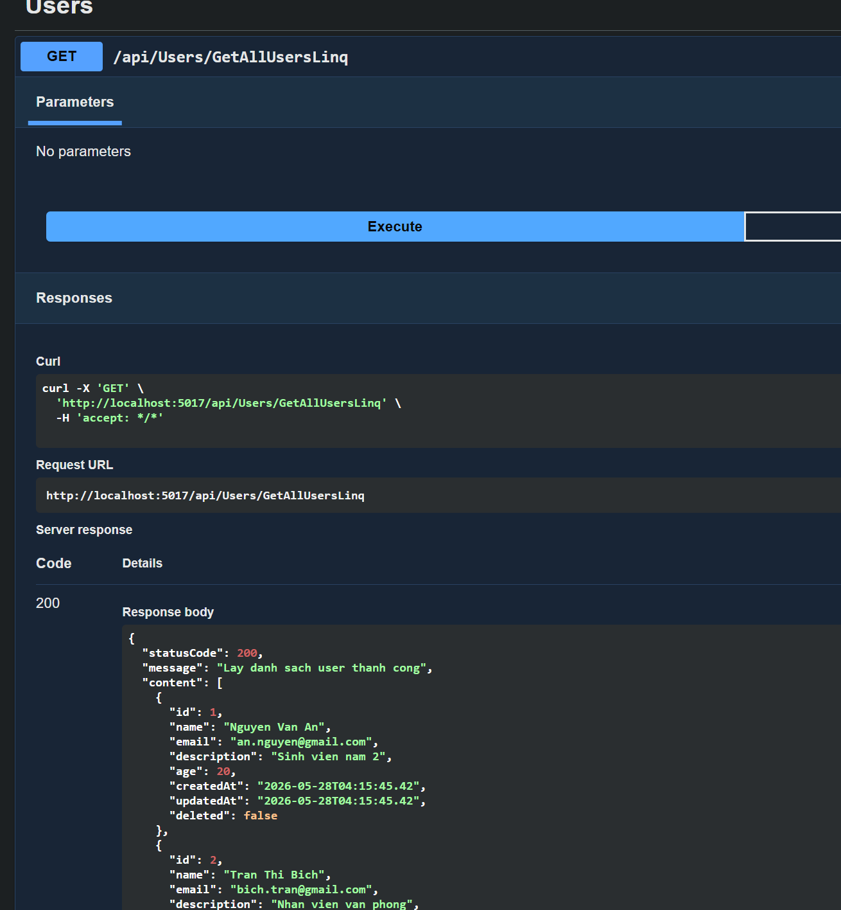
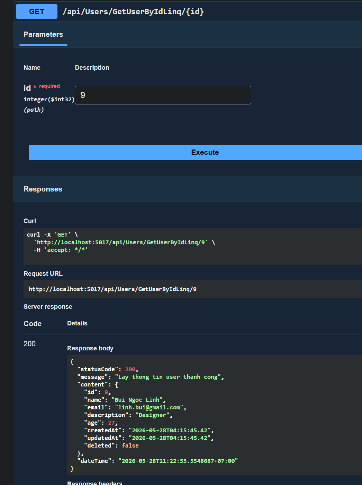
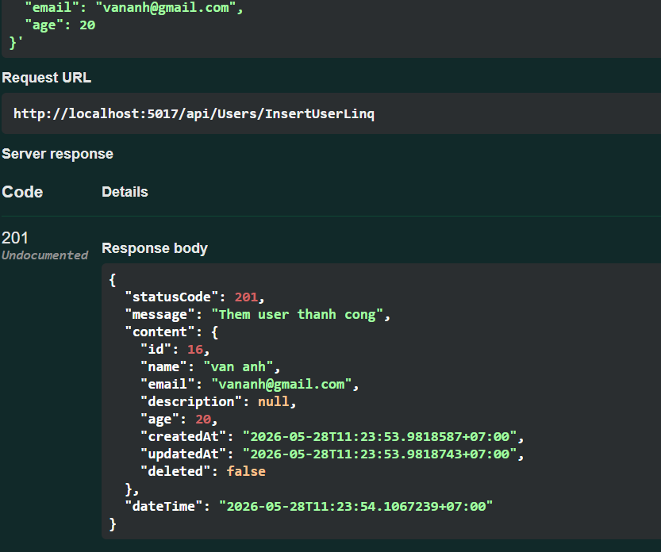
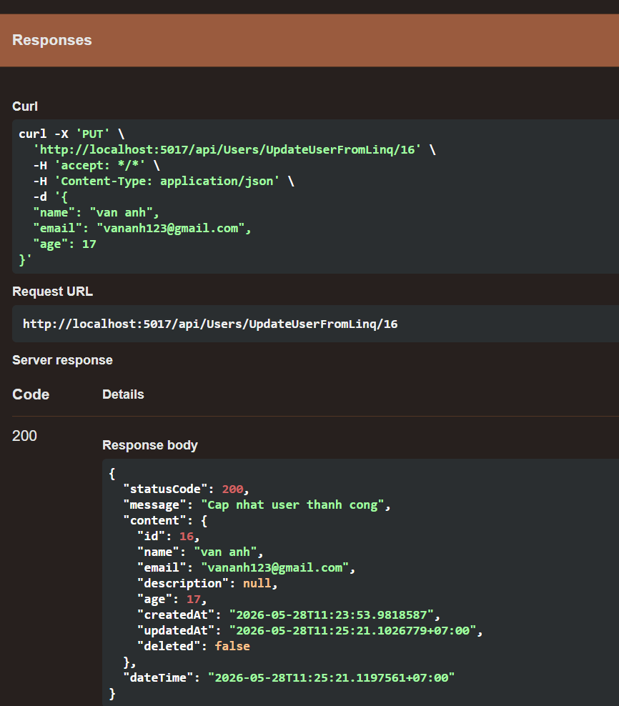
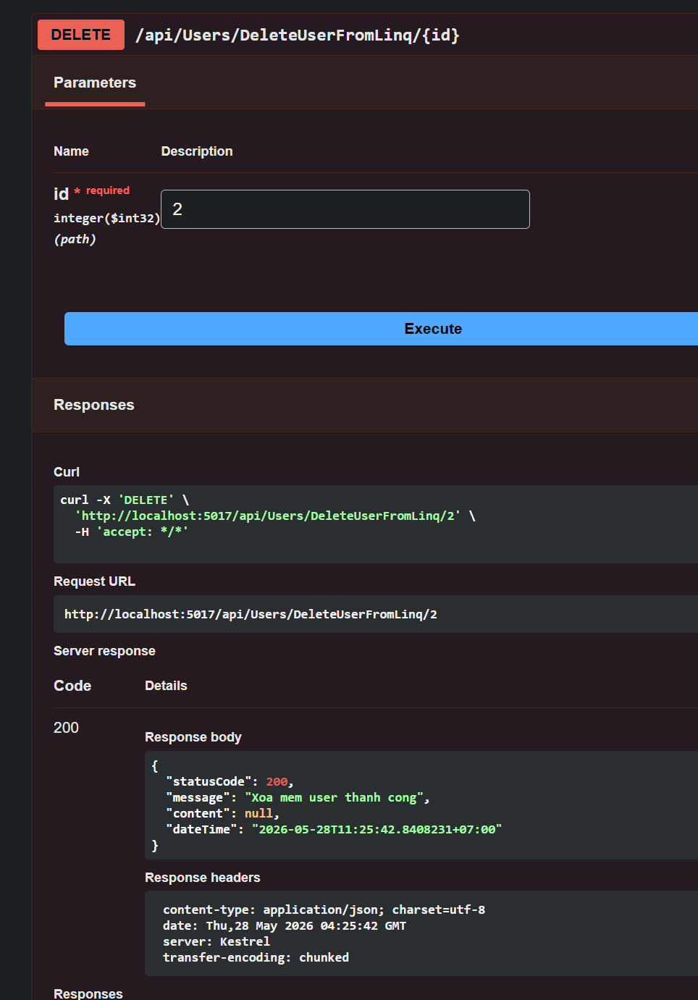
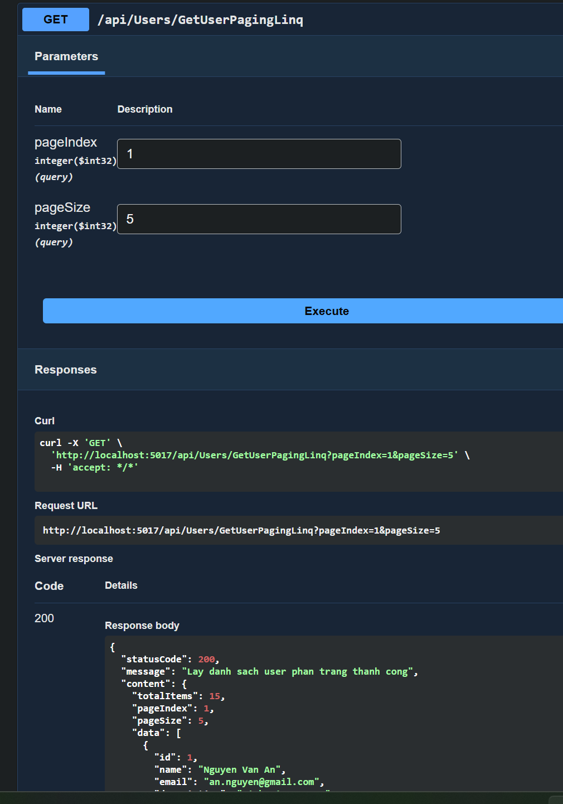
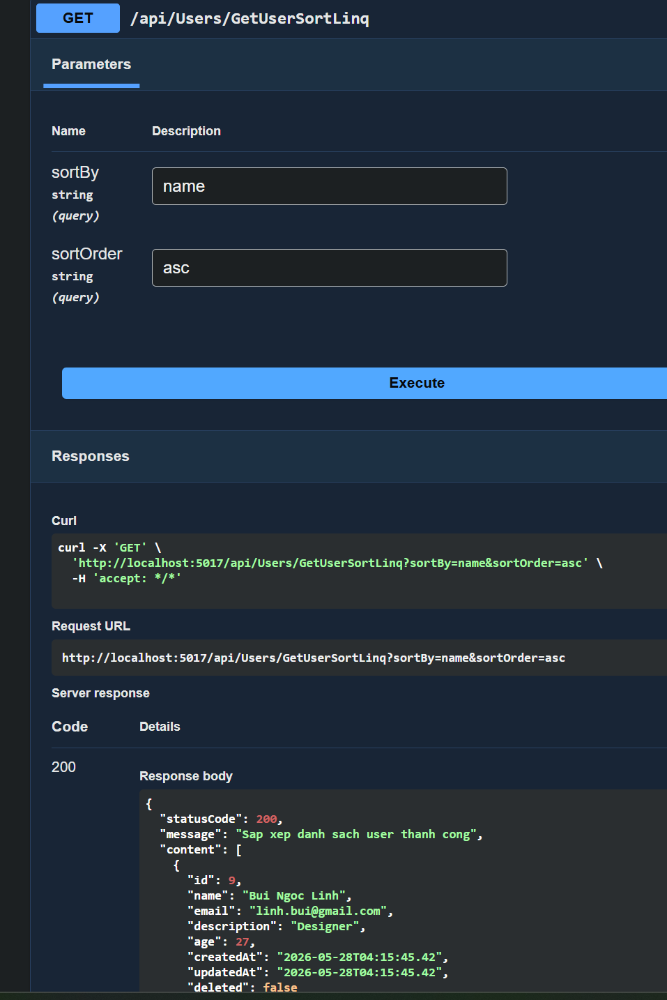
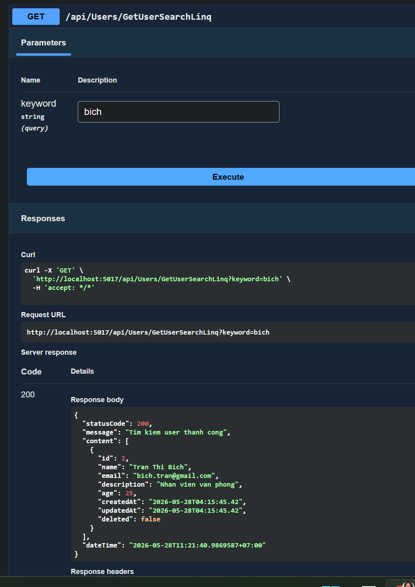
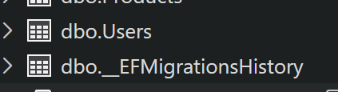

# 🚀 User Management API

---

## 📌 About This Project

This project is a practice exercise from the **.NET Bootcamp** program.
The goal is to build a **User Management API** using **ASP.NET Core Web API** and **Entity Framework Core Code First**.

The project focuses on basic backend API development, including CRUD operations, paging, sorting, searching, soft delete, database migration, and unified API responses.

---

## 🛠 Technologies Used

* ASP.NET Core Web API
* Entity Framework Core
* SQL Server
* LINQ
* Swagger
* Code First Migration
* Git & GitHub

---

## 📂 Project Structure

```text
UserManagementApi
│
├── Controllers
│   └── UsersController.cs
│
├── Data
│   └── AppDbContext.cs
│
├── DTOs
│   ├── UserCreateDTO.cs
│   ├── UserUpdateDTO.cs
│   └── ApiResponse.cs
│
├── Models
│   └── User.cs
│
├── Migrations
│
├── Screenshots
│   ├── getAllUser.png
│   ├── getUserById.png
│   ├── insertUser.png
│   ├── update.png
│   ├── delete.png
│   ├── getUserPaging.png
│   ├── sorting.png
│   ├── searching.png
│   └── migration.png
│
├── appsettings.json
├── Program.cs
└── README.md
```

---

## ✨ Main Features

* Get all active users
* Get user detail by Id
* Create a new user
* Update existing user
* Soft delete user
* Paging user list
* Sorting user list
* Searching user by name
* Unified API response format
* Database creation using Code First Migration

---

## 🗄 Users Table Structure

| Column      | Data Type | Description                 |
| ----------- | --------- | --------------------------- |
| Id          | int       | Primary key, auto increment |
| Name        | string    | User name, required         |
| Email       | string    | User email, required        |
| Description | string    | User description, nullable  |
| Age         | int       | User age                    |
| CreatedAt   | DateTime  | Created time                |
| UpdatedAt   | DateTime  | Updated time                |
| Deleted     | bool      | Soft delete status          |

---

## 🔗 API Endpoints

| Method | Endpoint                                               | Description                          |
| ------ | ------------------------------------------------------ | ------------------------------------ |
| GET    | `/api/Users/GetAllUserLinq`                            | Get all users with `Deleted = false` |
| GET    | `/api/Users/GetUserByIdLinq/{id}`                      | Get user detail by Id                |
| POST   | `/api/Users/InsertUserLinq`                            | Create a new user                    |
| PUT    | `/api/Users/UpdateUserFromLinq/{id}`                   | Update an existing user              |
| DELETE | `/api/Users/DeleteUserFromLinq/{id}`                   | Soft delete user                     |
| GET    | `/api/Users/GetUserPagingLinq?pageIndex=1&pageSize=5`  | Get users with paging                |
| GET    | `/api/Users/GetUserSortLinq?sortBy=Name&sortOrder=asc` | Sort users                           |
| GET    | `/api/Users/GetUserSearchLinq?keyword=Nguyen`          | Search users by name                 |

---

## 📦 Unified Response Format

All APIs return the same response structure:

```json
{
  "statusCode": 200,
  "message": "Lay danh sach user thanh cong",
  "content": [],
  "dateTime": "2026-05-28T10:00:00"
}
```

## 📸 Swagger Test Screenshots

### 🔹 Get All Users



---

### 🔹 Get User By Id



---

### 🔹 Create User



---

### 🔹 Update User



---

### 🔹 Soft Delete User



---

### 🔹 Paging User



---

### 🔹 Sorting User



---

### 🔹 Searching User



---

### 🔹 Migration Image



---


---

## 📬 Contact

Connect with me via:
**[khanhvy0946265560@gmail.com](mailto:khanhvy0946265560@gmail.com)**

---

© 2026 khanhvy0908
